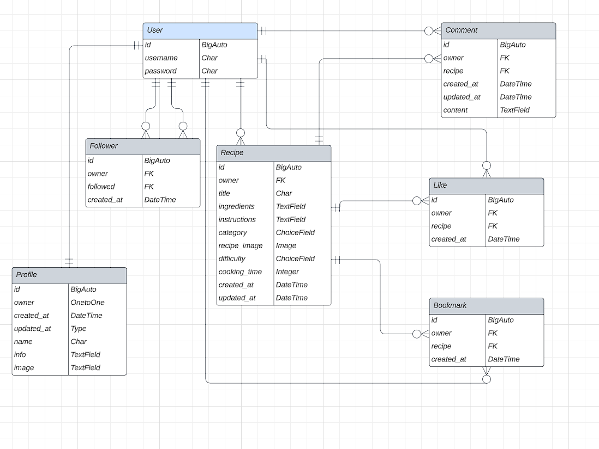

# FeedMe API

## Deployed project and repository

The live app can be accessed here: [FeedMe API](https://feedme-api.herokuapp.com/)

Repository for the front-end application: https://github.com/NatasaMiric/feedme

## Table of Content

[Project Goals](#Project-Goals)

[Agile implementation and planning](#Agile-implementation-and-planning)

[User Stories](#User-Stories)

[Database Design](#Database-design)

[Technologies Used](#Technologies-Used)

[Testing](#Testing)

[Deployment](#Deployment)

[Acknowledgment](#Acknowledgment)

---------------------------------------------
## Project Goals

FeedMe is a recipes sharing platform where users can share their recipes with other's.
The application consists of the React app and an API. Welcome to the Django Rest Framework API project section.
The goal for this API is to provide a backend service to allow the FeedMe front-end application to perform Create, Read, Update, and Delete operations via the user interface.

## Agile implementation and planning

The project was developed using an Agile approach by defining the epics and user stories that were implemented in 5 sprints, each lasting of one week. 

I used the GitHub project for planning and creating epics and user stories that were broken into tasks and each user story had assigned labels according to the app that it belong to and connected to the corresponding epic. MoSCoW prioritization was assigned to each user story to ensure that all core features are completed first. 

I decided to have one Kanban board where will I implement issues for both API and frontend application which I considered more practical and can be accessed [here](https://github.com/users/NatasaMiric/projects/4) to see more details for each ticket. 

## User Stories

* Project set up 

    As developer I want to set up my project and prepare for deployment so that I can start developing my app.

* Create the user profile API

    As a user, I can create a profile so that I can store and share information about myself with other users. 

* Create the recipe API

    As a user, I can store all recipes in a database so that I can retrieve, update and delete them.  

* Create the comment API  

    As a logged-in user, I can store comments in the database so that I can retrieve, update and delete them.

* Create the like API

    As a user, I can like a recipe so that I can show my support to the author of the recipe.

* Create bookmark API

    As a logged in user, I can save/bookmark recipes so that I can store in one place all recipes that I like the most.

* Search recipes API

    As a user, I can search data by author and recipe title so that I can find the recipe that interests me.

* Filter recipes API

    As a user, I can filter data by category and difficulty so that I can easier find the recipe that I need.

* Filter comments API

    As a user, I can retrieve all the comments associated with a given recipe so that I can easily access all comments related to that recipe.

## Database Design

## Technologies Used

### Languages
* HTML
* Python version 3.8.1

### Frameworks, Libraries & Programs
* Django 3.2.18 - a main framework used for application creation
* Django REST Framework 3.14.0 -  used for creating API
* Django Allauth - used for authentication, registration & account management
* Django filters
* gunicorn 20.1.0 - a Python WSGI HTTP Server
* dj-database-url 0.5.0 - allows us to utilize the DATABASE_URL variable
* psycopg2-2.9.6- a postgres database adapter that allows us to connect with a Postgres database.
* PostgreSQL - used as a database management system.
* Git - used for version control
* GitHub - project repository
* Heroku - used for hosting the application
* ElephantSQL - PostgreSQL database hosting service.
* Cloudinary 1.32.0 - for free image hosting
* Code Institute GitPod Full Template - Using the GitPod Full Template from the Code Institute for my project.

## Testing

### Manual testing 

* Testing The Profile App

Screenshots of manual testing are provided in the comment section of the respective user story:
https://github.com/users/NatasaMiric/projects/4/views/1?pane=issue&itemId=26047295

| Feature | Expected Outcome | Testing Performed | Result | Pass/Fail |
| :--- | :--- | :--- | :--- | :--- |
| Profile List | Get all profiles listed as logged out and logged-in user| Go to profiles page, check if profiles are listed in logged out state, then check the same in logged in state | All profiles are listed in both cases | Pass |
| Profile Detail View | Get profile detail view by specific id as logged in and logged out user | Go to the the profiles page and entered an existing id in url field in logged out state, repeated the same after logging in | The Profile Details are present | Pass |
| Get profile detail view by nonexisting id as logged in and logged out user  | not found 404 error | Go to the profiles page and enter a non-existing id in url field in logged out state, repeated the same after logging in |  The 404 error has been displayed | Pass |
| Profile Detail Update | As logged in user, the user should be able to edit a profile that he owns | Go to profiles page and logged in, entered my id in url field that redirected me to the profile detail page | The update form is present on the page | Pass |
|  | Not possible to edit someone else's profile | Navigated to profiles page and logged in, entered id from other user in url field that redirected me to profile detail page | The update form is not present on the page | Pass|
| Authorization(isOwner permission) | As logged out user, is-owner field is false on all profiles listed on the page | Go to profiles page and check is_owner fields | All of them are false | Pass |
|  | As logged out user my profile detail shows is_owner false | Go to profiles page and enter a corresponding id in url to user  | As expected, is_owner field is false |Pass |
| | As logged in user is_owner field is true on the profile detail list of currently logged in user and false on the rest of the profiles | Go to the profiles page and check profile list | Is_owner field is true on logged in user field and false on the rest | Pass |
|  | As logged in user, on the profile detail page of the logged-in user, is_owner is true | Go to logged in users page by adding an id to profiles url and that will redirect to profile detail page of the logged in user | is_owner field is true | Pass |
|  | As logged in user, on the profile detail page of another users, is_owner is false | Go to profiles page and add an id from another user to profiles url and that will redirect to profile detail page of the other user | is_owner field is false | Pass |

* Testing The Recipes App

Screenshots of manual testing are provided in the comment section of the respective user story:
https://github.com/users/NatasaMiric/projects/4/views/1?pane=issue&itemId=26050307

| Feature | Expected Outcome | Testing Performed | Result | Pass/Fail |
| :--- | :--- | :--- | :--- | :--- |
| Recipe list | If the user is logged out he should be able to see the list of all recipes | Go to recipes url | All recipes are listed | Pass |
| | If the user is logged in he should be able to see the list of all recipes | Navigated to recipes url  | All recipes are listed | Pass |
| Recipe Detail view | If the user is logged out, he should be able to see the recipe details of his and another user's recipes | Navigated to recipes page and added an existing id to url of my recipe and then repeated the same by typing id from another user  | Recipe details are present  | Pass |
|  | If the user is logged in, he should be able to see the recipe details of his and other user's recipes| Navigated to recipes page and add an existing id to url by my own recipe and then repeat the same by typing id from the another user | Recipe details are present  | Pass |
|  | If the user tries to fetch a recipe by non-existing id, he should get a 404 error message  | Navigated to the recipes page and added an nonexisting id to url  | The 404 error message 'not found' is shown | Pass |
| Create a recipe | If the user is logged in, he should be able to create a new recipe  | Navigated to the recipes page and filled-out the form on bottom of the page then click 'post' | New recipe is created | Pass |
| Update a recipe | As logged in user and owner of the recipe, user should be able to update a recipe | Navigated to the recipes page and add a specific id in url that belongs to logged in user. Got the access to recipe detail page where the form for updating is present. Updated the fields and then clicked 'put' | Taken to correct page and update form present. Recipe successfully updated. | Pass |
| Delete a recipe | As logged in user and owner of the recipe, the user should be able to delete a recipe | Navigated to the recipes page and added a specific id in url that belongs to logged in user. Got the access to the recipe detail page where delete button is present and clicked on it | Recipe has been deleted | Pass |

* Testing Comments app

Screenshot of manual testing are provided in comment section of the respective user story:
https://github.com/users/NatasaMiric/projects/4/views/1?pane=issue&itemId=26052261

| Feature | Expected Outcome | Testing Performed | Result | Pass/Fail |
| :--- | :--- | :--- | :--- | :--- |
| Comment List  | If the user is logged out or logged in, he should be able to see the list of all comments | Navigated to the comments page in logged in and logged out state  | All comments are listed in both cases| Pass |
| Create comment | If the user is logged in, the user should be able to create a comment | Navigated to the comments page and found comment form on the bottom, underneath the comments list, filled out the form and clicked 'post' | The comment has been created | Pass |
| Update comment| As logged in user and owner of the comment, the user should be able to update his comment | Navigated to the comments page and added a correct comment id to url to retrieve a particular comment that should be updated | Form for updating is present on the page and it is updated after changing the data and clicking on 'put' | Pass |
| Delete comment| As logged in user and owner of the comment, user should be able to delete his comment | Navigated to the comments page and added a correct comment id to url to retrieve a particular comment that should be deleted | Delete button is present on the page and comment is deleted after clicking on the button | Pass |

* Testing Likes app

Screenshots of manual testing are provided in the comment section of the respective user story:
https://github.com/users/NatasaMiric/projects/4/views/1?pane=issue&itemId=26052843

| Feature | Expected Outcome | Testing Performed | Result | Pass/Fail |
| :--- | :--- | :--- | :--- | :--- |
| List all likes | If the user is logged out or logged in, he should be able to see the list of all likes | Navigated to the likes page  | All likes are listed in both cases | Pass |
| Like a recipe | If the user is logged in, user should be able to like a recipe | Navigated to the likes page and found form on the bottom for liking a recipe, choosed a recipe and clicked 'post' | The recipe has been liked | Pass |
| Unlike a recipe | If the user is logged in, user should be able to delete a like | Navigated to likes page and then added to url an id of the like that you would like to delete. This has taken me to like detail page where delete button is. Clicked on button.  | The like has been deleted | Pass |
| Handle duplicate likes | If the user tries to like the recipe that he already liked, he should get the message about possible duplicate | Choosed the recipe that I already liked and clicked post | The message 400 bad request, possible duplicate has been displayed  | Pass |

* Testing Bookmarks app

Screenshots of manual testing are provided in the comment section of the respective user story:
https://github.com/users/NatasaMiric/projects/4/views/1?pane=issue&itemId=26098011

| Feature | Expected Outcome | Testing Performed | Result | Pass/Fail |
| :--- | :--- | :--- | :--- | :--- |
| List all bookmarked recipes that currently logged in user owns | The user should be logged in to be able to see his bookmarked recipes | Navigated to bookmarks page | All the recipes of the currently logged in user are displayed | Pass |
| Create bookmark | If logged in , the user should be able to create a bookmark | Navigated to bookmarks page, in the bookmark form choose recipe and clicked 'post' | The bookmark was created | Pass |
| Delete bookmark| If logged in, user should be able to delete a bookmark | Navigated to the specific bookmark by adding bookmarks and id in url and clicked on delete button | Bookmark was deleted | Pass|
| Retrieve bookmark from another user | User should not have an access to another user's bookmarks | Navigated to the specific bookmark by adding bookmarks and id in url from another user | The message 404 not found was displayed | Pass |
| Bookmark again the same recipe | User should not be able to bookmarks the same recipe again | Navigated to bookmarks page and choose the recipe that is already bookmarked | The message 400 bad request, possible duplicate has been displayed | Pass |
| Retrieve bookmark by nonexisting id | User should not have an access to nonexisting bookmarks | Navigated to the specific bookmark by adding bookmarks and nonexisting id in url  | The message 404 not found was displayed | Pass |

### Validators

All python code has been run through the python validator without issues.

### Bugs

## Deployment

* set the following environment variables:    
    * CLOUDINARY_URL
    * DATABASE_URL
    * DISABLE_COLLECTSTATIC
    * SECRET_KEY
    * DEV
* installed the following libraries to handle database connection:
    * psycopg2
    * dj-database-url
* configured dj-rest-auth library for JWTs
* set allowed hosts
* configured CORS:
    * set allowed_origins
* set default renderer to JSON
* added Procfile with release and web commands
* gitignored the env.py file
* generated requirements.txt
* deployed to Heroku

## Acknowledgment

The project was based on [Code Institute DRF walkthrough project](https://github.com/Code-Institute-Solutions/drf-api) with several adjustments in order to create my own project. 
