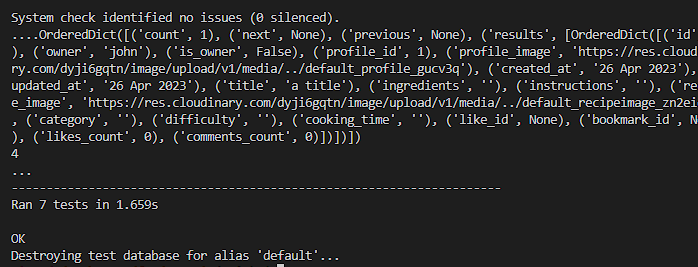

# FeedMe API

## Deployed project and repository

The live app can be accessed here: [FeedMe API](https://feedme-api.herokuapp.com/)

Repository for the front-end application: https://github.com/NatasaMiric/feedme

## Table of Content

[Project Goals](#Project-Goals)

[Agile implementation and planning](#Agile-implementation-and-planning)

[User Stories](#User-Stories)

[Database Design](#Database-design)

[Technologies Used](#Technologies-Used)

[Testing](#Testing)

[Deployment](#Deployment)

[Acknowledgment](#Acknowledgment)

---------------------------------------------
## Project Goals

FeedMe is a recipes sharing platform where users can share their recipes with other's.
The application consists of the React app and an API. Welcome to the Django Rest Framework API project section.
The goal for this API is to provide a backend service to allow the FeedMe front-end application to perform Create, Read, Update, and Delete operations via the user interface.

## Agile implementation and planning

The project was developed using an Agile approach by defining the epics and user stories that were implemented in 6 sprints, each lasting of approximately one week. 

I used the GitHub project for planning and creating epics and user stories that were broken into tasks and each user story had assigned labels according to the app that it belong to and connected to the corresponding epic. MoSCoW prioritization was assigned to each user story to ensure that all core features are completed first. 

I decided to have one Kanban board where will I implement issues for both API and frontend application which I considered more practical and can be accessed [here](https://github.com/users/NatasaMiric/projects/4) to see more details for each ticket. 

## User Stories

* Project set up 

    As developer I want to set up my project and prepare for deployment so that I can start developing my app.

* Create the user profile API

    As a user, I can create a profile so that I can store and share information about myself with other users. 

* Create the recipe API

    As a user, I can store all recipes in a database so that I can retrieve, update and delete them.  

* Create the comment API  

    As a logged-in user, I can store comments in the database so that I can retrieve, update and delete them.

* Create the like API

    As a user, I can like a recipe so that I can show my support to the author of the recipe.

* Create bookmark API

    As a logged in user, I can save/bookmark recipes so that I can store in one place all recipes that I like the most.

* Search recipes API

    As a user, I can search data by author and recipe title so that I can find the recipe that interests me.

* Filter recipes API

    As a user, I can filter data by category and difficulty so that I can easier find the recipe that I need.

* Filter comments API

    As a user, I can retrieve all the comments associated with a given recipe so that I can easily access all comments related to that recipe.

* Follow/Unfollow user API

    As a logged in user I can follow and unfollow other users so that I can see and remove posts by specific users in my posts feed

## Database Design

## Technologies Used

### Languages
* HTML
* Python version 3.8.1

### Frameworks, Libraries & Programs
* Django 3.2.18 - a main framework used for application creation
* Django REST Framework 3.14.0 -  used for creating API
* Django Allauth - used for authentication, registration & account management
* Django filters
* gunicorn 20.1.0 - a Python WSGI HTTP Server
* dj-database-url 0.5.0 - allows us to utilize the DATABASE_URL variable
* psycopg2-2.9.6- a postgres database adapter that allows us to connect with a Postgres database.
* PostgreSQL - used as a database management system.
* Git - used for version control
* GitHub - project repository
* Heroku - used for hosting the application
* ElephantSQL - PostgreSQL database hosting service.
* Cloudinary 1.32.0 - for free image hosting
* Code Institute GitPod Full Template - Using the GitPod Full Template from the Code Institute for my project.

## Testing

### Validators

All python code has been run through the python validator without issues.

### Automated testing

Automated tests have been built to test the Recipes app, in total 7 tests. Tests are created for :

* logged out users can list posts
* logged in users can create a post
* logged out users can't create a post
* logged out users can retrieve a post with a valid id
* logged out users can't retrieve a post with an invalid id
* logged in users can update a post they own
* logged in users can't update a post they don't own

    

### Bugs

No bugs has been detected at the moment of project finalization. 

## Deployment

Workspace setup:

    1. Go to [Code Institute GitHub profile](https://github.com/Code-Institute-Org) and find [ci-full-template](https://github.com/Code-Institute-Org/ci-full-template) and click on use this template
    2. Opne the workspace using the green Gitpod button
    3. In terminal: install Django `pip install ‘django<4’` 
                    create project `django-admin startproject PROJ_NAME .`
                    install Cloudinary storage `pip install django-cloudinary-storage==0.3.0`
                    install Pillow (Image Processing) `pip install Pillow==8.2.0` 
    4. In settings.py, add cloudinary to installed apps and create storage
    5. Start the app with python manage.py runserver

Deployment to Heroku: 

* set the following environment variables:    
    * CLOUDINARY_URL
    * DATABASE_URL
    * DISABLE_COLLECTSTATIC
    * SECRET_KEY
    * DEV
* installed the following libraries to handle database connection:
    * psycopg2
    * dj-database-url
* configured dj-rest-auth library for JWTs
* set allowed hosts
* configured CORS:
    * set allowed_origins
* set default renderer to JSON
* added Procfile with release and web commands
* gitignored the env.py file
* generated requirements.txt
* deployed to Heroku

## Acknowledgment

The project was based on [Code Institute DRF walkthrough project](https://github.com/Code-Institute-Solutions/drf-api) with several adjustments in order to create my own project. 
